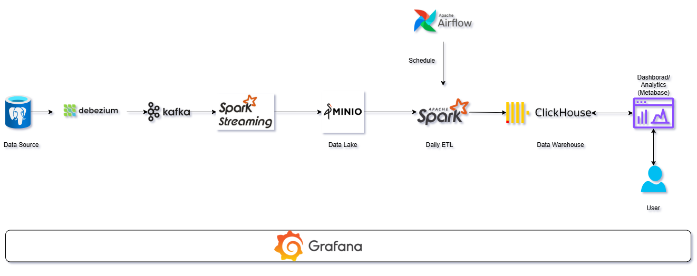
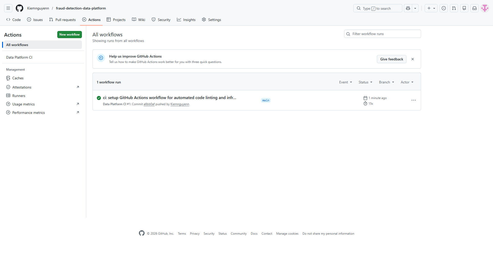
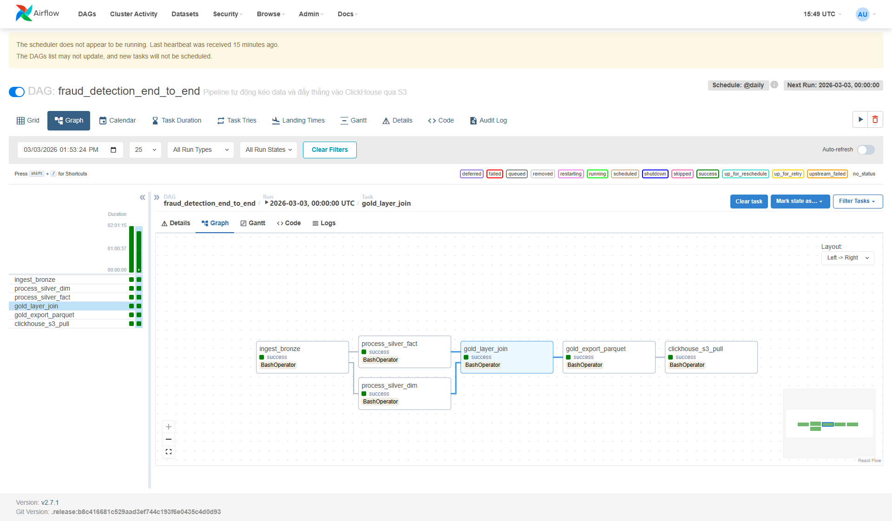
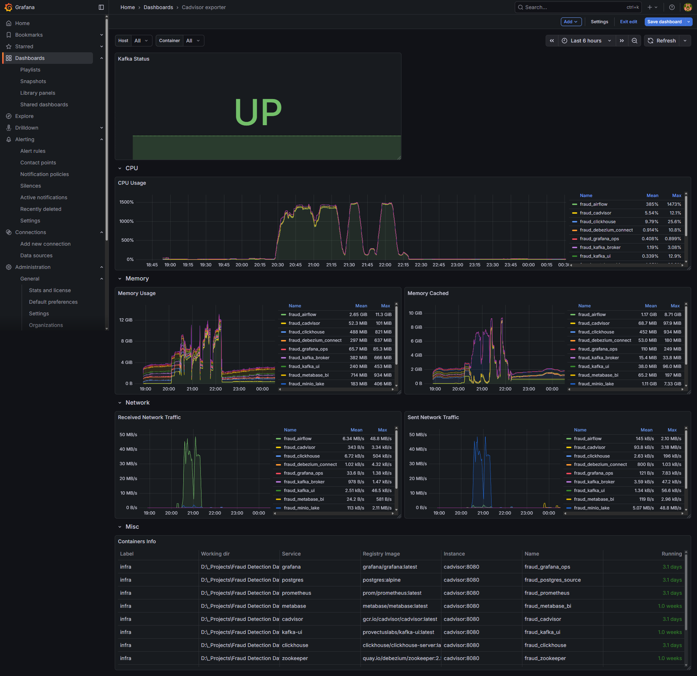
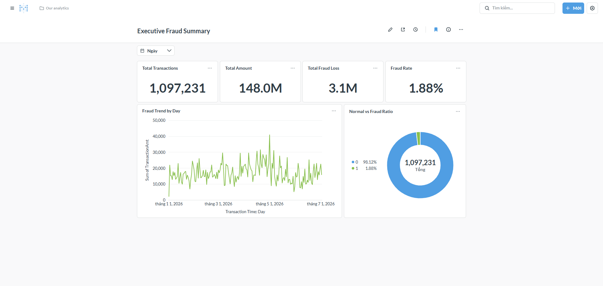
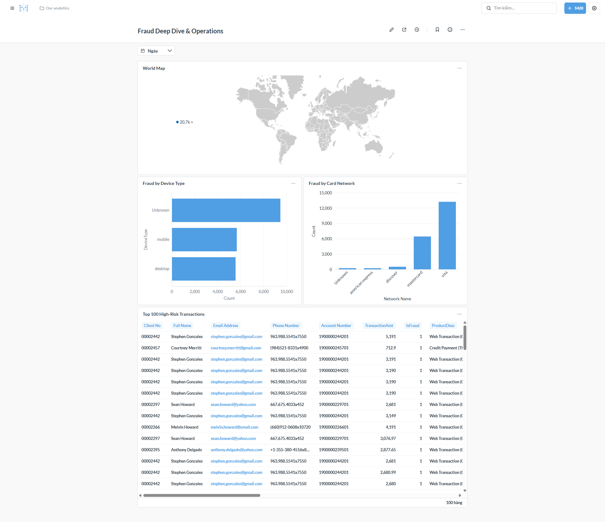

# End-to-End Fraud Detection Data Platform

## Project Overview
This project is a comprehensive, production-ready Data Engineering platform designed to process, analyze, and detect fraudulent transactions. Built with a strict "Stability First" mindset, the architecture emphasizes system reliability, operational excellence, and performance engineering. It handles both batch and streaming data pipelines while integrating robust observability and CI/CD practices.

## System Architecture & Technology Stack
The platform is architected to decouple ingestion, processing, storage, and monitoring, ensuring scalability and fault tolerance.



* Data Ingestion (Streaming & CDC): Apache Kafka, Debezium, PostgreSQL
* Data Processing (Batch & Micro-batch): Apache Spark (PySpark)
* Data Storage & Data Warehouse: ClickHouse, MinIO (Data Lake)
* Orchestration & Scheduling: Apache Airflow
* Observability & Monitoring: Prometheus, Grafana, cAdvisor
* CI/CD & Automation: GitHub Actions, Docker Compose

## Key Engineering Achievements (System & Data Ops)

### 1. Performance Engineering & Spark Tuning
* Mitigated Out-Of-Memory (OOM) issues in resource-constrained environments by explicitly managing Spark executors, driver memory allocations, and tuning shuffle partitions.
* Optimized data transformation stages to prevent data skew and minimize heavy shuffling across the cluster.
* Demonstrated strong understanding of Spark internals (stages, tasks, memory management) to balance processing throughput with system stability.

### 2. Observability & Infrastructure Monitoring
* Implemented a comprehensive monitoring stack using Prometheus and Grafana to track the health of distributed systems.
* Created custom dashboards to monitor real-time CPU/Memory usage, disk I/O, and network throughput across all Docker containers.
* Established "heartbeat" monitoring for the Kafka Broker to ensure data pipeline integrity and proactively detect upstream failures.

### 3. Continuous Integration & Deployment (CI/CD)
* Integrated GitHub Actions to automate code quality checks (Flake8 linting) for all Python scripts and Airflow DAGs.
* Implemented automated infrastructure validation to verify the integrity of the Docker Compose configurations before deployment, ensuring stable infrastructure updates.

### 4. Workflow Orchestration & Data Backfilling
* Designed robust Airflow DAGs with explicit dependency management and task retry mechanisms to handle transient failures.
* Structured the pipeline to support complex data backfilling and recovery operations without causing data duplication.

## Data Source
The base dataset for this project was sourced from Kaggle https://www.kaggle.com/competitions/ieee-fraud-detection/overview. To simulate a real-world production environment, a custom Python generator script was developed to continuously ingest this static data into the PostgreSQL source database, triggering the CDC pipeline via Debezium and Kafka.

## Showcase & System Metrics

### CI/CD Pipeline Validation


### Airflow DAG Orchestration


### Infrastructure & Kafka Health Monitoring


### Business Intelligence & Analytics (Metabase)
**1. Executive Fraud Summary**


**2. Fraud Deep Dive & Operations**


## Repository Structure
```text
.
├── .github/workflows/       # CI/CD Pipeline configurations
├── dags/                    # Airflow DAGs for orchestration
├── docs/showcase/           # Architecture diagrams and system screenshots
├── infra/                   # Infrastructure configuration
│   ├── configs/             # Prometheus and ClickHouse configurations
│   ├── postgres_init/       # DDL SQL scripts for database schema initialization
│   ├── docker-compose.yml   # Docker container orchestration
│   └── Dockerfile.airflow   # Custom Airflow image with dependencies
└── src/                     # Core logic
    ├── enrichment/          # Data enrichment scripts
    ├── exploration/         # Data quality and validation checks
    ├── ingestion/           # Data generators and Postgres loaders
    ├── spark_jobs/          # PySpark transformation jobs (Bronze, Silver, Gold)
    └── utils/               # Shared utilities and database connections
```

## How to Run Locally

### 1. Infrastructure & Database Initialization

Start the core services. The PostgreSQL database is automatically initialized with the required schemas using the DDL scripts located in `infra/postgres_init/`.

```bash
docker compose -f infra/docker-compose.yml up -d

```

### 2. Data Generation (Simulation)

Execute the custom data loader to populate the source database and trigger the Kafka streaming pipeline.

```bash
python src/ingestion/load_data_to_postgres.py

```

### 3. Pipeline Orchestration & Monitoring

* Airflow UI: Access `http://localhost:8082` to schedule and monitor the PySpark batch jobs.
* Grafana Dashboard: Access `http://localhost:3000` for real-time system monitoring, resource tracking, and Kafka Broker health checks.